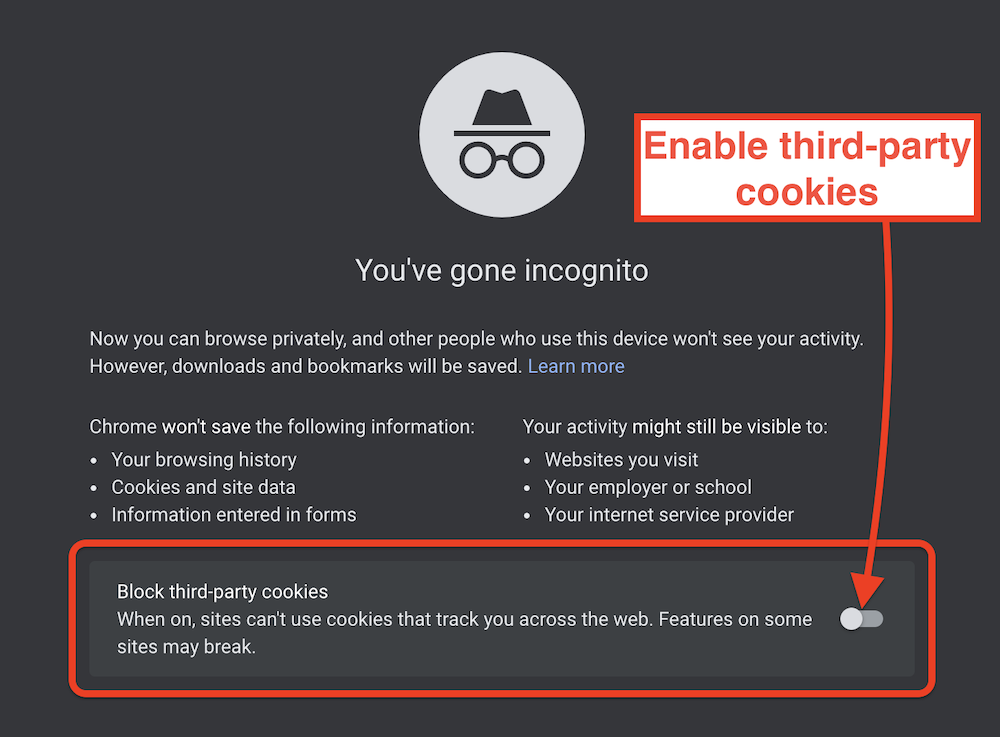

[](https://imagekit.io)

# ImageKit Media Library Widget

[](https://www.npmjs.com/package/imagekit-media-library-widget)

This plugin provides access to ImageKit Media Library through an embeddable UI within your own CMS or website.


## Table of Contents

1. [Installation](#installation)
1. [Usage](#usage)
1. [Demo](#demo)

---

## Installation

### Using CDN

```html
<script src="https://unpkg.com/imagekit-media-library-widget/dist/imagekit-media-library-widget.min.js"></script>
```

### Using NPM

Install `imagekit-media-library-widget`:

```bash
npm install --save imagekit-media-library-widget
```

Now include it in your JS code:

```js
// ES6 module
import IKMediaLibraryWidgetCore from 'imagekit-media-library-widget';

// Common JS syntax
const IKMediaLibraryWidgetCore = require("imagekit-media-library-widget");
```
---

## Usage

Check out our detailed guide on ImageKit Docs: [Media Library Widget](https://docs.imagekit.io/sample-projects/embeddable-media-library-widget)

### Quick start (HTML and JS)

Include the script in your HTML:

```html
<script src="https://unpkg.com/imagekit-media-library-widget/dist/imagekit-media-library-widget.min.js"></script>
```

Define a DOM container for the plugin. This accepts any CSS selector:

```html
<div id="container"></div>
```
or
```html
<div class="container"></div>
```

Configure and instantiate the plugin:

```js
// configuration options
var config = {
  container: '#container',   // the element in which the Media Library Widget will be rendered
  className: 'media-library-widget',
  dimensions: {
    height: '100%',
    width: '100%',
  },
  view: 'modal',  // inline | modal (default)
  renderOpenButton: true,  // false | true (default)
  /*
  mlSettings: {  // optional
    initialView: {  
      
      // sets initial state of Media Library, refer to the ImageKit Docs for more information
      // https://docs.imagekit.io/sample-projects/embeddable-media-library-widget

      // only one of the following parameters can be passed at a time
    
      folderPath: "<your-folder-path>",
      fileId: "<file_id>",
      searchQuery: "<search-query>",
      collection: { 
         // pass empty object to open Media Collections page
         id: "<collection-id>" // open specific Media Collection
      },
      fileType: "images" | "videos" | "cssJs" | "others"
    },
    multiple: true // false | true (default)
    maxFiles: 20 // relevant when `multiple` is true
    toolbar: {
      // sets the visibility of the toolbar buttons
      // defaults to true for all buttons
      showCloseButton: false,
      showInsertButton: false
    }
  }
  */
};

// define callback handler
function callback(payload) {
  // this is the callback handler
  // … consume json payload …
}

// instantiate the Media Library Widget plugin
var mediaLibraryWidget = new IKMediaLibraryWidget(config, callback);
```


**Note: Google Chrome (Incognito)**

To use this plugin on Google Chrome in Incognito mode, you need to enable third-party cookies:



---

## Demo

Run following commands:

```bash
npm install
npm run sample
```
It will install dependencies and serve the included demo: `sample-app`.
The sample app should be available on `http://localhost:3000`.

